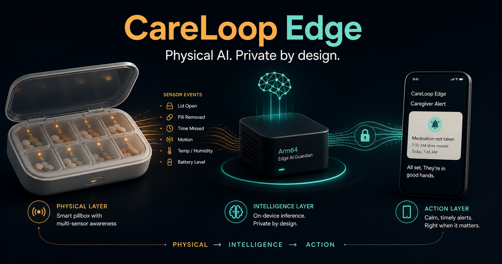
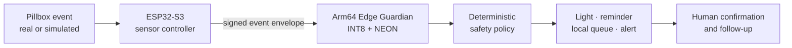
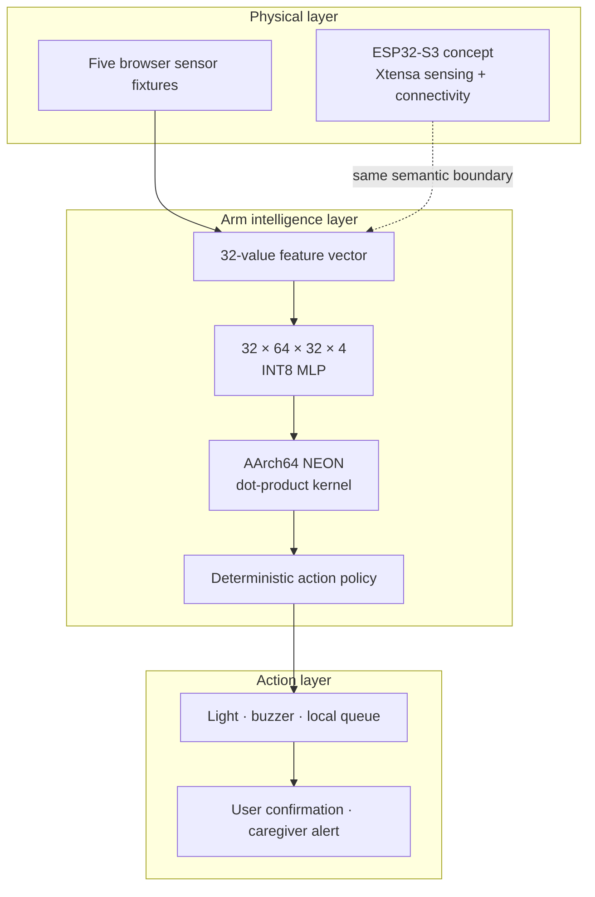

<div align="center">
  
  <h1>CareLoop Edge</h1>
  <p><strong>Smart Pillbox AI · Arm Physical AI Competition Edition</strong></p>
  <p>Simulated pillbox sensing · Native Arm64 inference · Bounded medication-safety actions</p>
  <p>
    <a href="https://careloop-edge-arm-ai.stephenovo.workers.dev"><strong>Live judge experience</strong></a>
    ·
    <a href="https://github.com/stephenovo/Smart-Pillbox-AI">Original Smart Pillbox AI</a>
    ·
    <a href="docs/ARCHITECTURE.md">Architecture</a>
    ·
    <a href="docs/DEVPOST_SUBMISSION.md">Submission draft</a>
  </p>
  <p>
    
    
    
    
    
    
  </p>
</div>

<p align="center">
  
</p>

## Overview

CareLoop Edge is a competition-focused edition of
[Smart Pillbox AI](https://github.com/stephenovo/Smart-Pillbox-AI), created for
the **Arm Create: AI Optimization Challenge · Physical AI track**. It keeps the
same medication-safety concept, then isolates one question for judges and
developers:

> Can a pillbox turn privacy-sensitive sensor events into fast, local and
> bounded safety actions on Arm64—even when the internet is unavailable?

The project pairs a judge-facing web experience with a native C inference
kernel. The browser replays five clearly labelled, production-shaped sensor
fixtures; the measurable optimization evidence comes from an Arm64-only
benchmark with an INT8 Arm NEON fast path and an FP32 scalar reference.

## Relationship to Smart Pillbox AI

This repository is a **standalone competition sibling**, not a rename or
replacement for the original product.

| | Original Smart Pillbox AI | CareLoop Edge |
| --- | --- | --- |
| **Purpose** | End-to-end medication care platform | Arm competition and optimization proof |
| **Main surfaces** | Web dashboard, native iOS app, Studio, ESP32-S3 path | Interactive judge console, Arm64 C kernel, benchmark evidence |
| **AI focus** | Care experience and medication activity insight | Local INT8 risk scoring and bounded physical actions |
| **Hardware role** | ESP32-S3 firmware and live device workflow | ESP32-S3 semantic events are simulated; Arm64 compute is benchmarked natively |
| **Deployment** | Independent production product | Independent Cloudflare Worker and GitHub repository |

The original repository, deployment and `smartpb.me` domain remain untouched.

## Product loop



ESP32-S3 uses Xtensa LX7, not Arm. In this architecture it remains the
deterministic sensing and connectivity tier; a nearby Arm64 node owns the local
inference workload.

## What is implemented

| Area | Competition deliverable |
| --- | --- |
| **Interactive judge console** | Five replayable scenarios: on-time dose, missed window, wrong compartment, repeat opening and network outage |
| **Transparent evidence model** | The UI separates simulated sensor inputs, native Apple Silicon Arm64 measurements and open-source proof artifacts |
| **Arm64 inference kernel** | Portable C implementation with an AArch64/Arm NEON INT8 dot-product path and scalar fallback |
| **Reference comparison** | Deliberately scalar FP32 path for reproducible before/after comparison |
| **Optimization artifacts** | 4× smaller weights, 4× smaller activation workspace and host-recorded latency evidence |
| **Reproducible harness** | Arm64 architecture gate, warm-up, 100,000 iterations per run, seven runs and median reporting |
| **Bounded actions** | Deterministic policy maps risk scores to confirmation, reminder, hold-and-confirm or caregiver-alert actions |
| **Competition documentation** | Architecture disclosure, Devpost copy, recording outline and deadline-aware demo-day checklist |

## Arm64 evidence snapshot

The checked-in development-host run was recorded on Apple Silicon Arm64. These
numbers are **host-specific evidence**, not universal performance claims.

| Measurement | FP32 scalar | INT8 Arm NEON | Change |
| --- | ---: | ---: | ---: |
| Median inference latency | 4.751 µs | 0.140 µs | **34.02× faster** |
| Model weights | 17,408 B | 4,352 B | **75% smaller** |
| Activation workspace | 512 B | 128 B | **75% smaller** |

Method: 10 warm-ups, 100,000 inferences per sample, seven runs, median reported.
Inspect the [latest captured result](evidence/benchmark.arm64.latest.json) and
the [frozen website dataset](evidence/benchmark.arm64.sample.json), then rerun
the harness on the Arm64 host used for judging.

## Architecture



The website does not pretend to execute the native C benchmark in the browser.
It presents the product interaction while linking directly to the separately
recorded Arm64 evidence and the code required to reproduce it.

## Repository layout

```text
Careloop-Edge-Arm-AI/
├── app/
│   ├── EdgeConsole.tsx          # Interactive Physical AI judge experience
│   └── globals.css              # Responsive competition visual system
├── edge/
│   ├── model/                   # FP32 reference + INT8/NEON C kernel
│   └── benchmark/               # Native timing harness
├── evidence/                    # Host result and disclosed display dataset
├── scripts/benchmark.sh         # Arm64-gated compile-and-run entry point
├── tests/                       # Rendered competition-experience checks
├── docs/
│   ├── ARCHITECTURE.md          # Hardware boundary and safety design
│   ├── DEVPOST_SUBMISSION.md    # Submission narrative and video outline
│   └── DEMO_DAY_CHECKLIST.md    # Recording and final-submission runbook
├── public/og.png                # Competition architecture artwork
└── wrangler.jsonc               # Independent Cloudflare deployment
```

## Quick start

Requirements: Node.js 22.13+, npm and a modern browser.

```bash
git clone https://github.com/stephenovo/Careloop-Edge-Arm-AI.git
cd Careloop-Edge-Arm-AI
npm install
npm run dev
```

Open [http://localhost:3000](http://localhost:3000), or use the deployed
[judge experience](https://careloop-edge-arm-ai.stephenovo.workers.dev).

## Reproduce the Arm benchmark

Use Apple Silicon, Raspberry Pi 4/5 or another Arm64 Linux host with a C
compiler:

```bash
uname -m
npm run benchmark:arm -- 100000
```

The script refuses non-Arm64 hosts, builds with `-O3`, runs both kernels and
prints machine-readable JSON. On Apple Silicon, `uname -m` should report
`arm64`; on Arm Linux it commonly reports `aarch64`.

## Verification

```bash
# Source lint, production build and rendered HTML test
npm run lint
npm test

# Native Arm64 optimization evidence
npm run benchmark:arm -- 100000
```

The web test also guards the disclosure boundary: sensor fixtures must be
labelled as simulated, and browser copy must not represent them as a physical
hardware run.

## Deploy the independent Cloudflare Worker

```bash
npm run deploy:cloudflare
```

This publishes the standalone `careloop-edge-arm-ai` Worker. It does not modify
the original Smart Pillbox AI service or domain.

## Hardware and evidence truth

- No physical pillbox or Raspberry Pi was available for this competition
  build.
- Sensor interactions in the website are explicitly simulated fixtures.
- Arm64 performance evidence is recorded natively on Apple Silicon and can be
  reproduced on another Arm64 host.
- ESP32-S3 is accurately described as an Xtensa sensor controller, never as an
  Arm processor.
- A future physical pillbox can replace the fixtures without changing the
  event-to-inference boundary.

## Safety boundary

CareLoop Edge observes compartment interactions and schedule-risk patterns. It
does **not** claim that medicine was swallowed, change dosage guidance, diagnose
a condition or replace a clinician. Model scores pass through deterministic
guardrails before any suggested light, reminder or caregiver action.

## Documentation

- [Architecture and no-hardware validation](docs/ARCHITECTURE.md)
- [Devpost submission draft and three-minute video outline](docs/DEVPOST_SUBMISSION.md)
- [Demo-day and final-submission checklist](docs/DEMO_DAY_CHECKLIST.md)
- [Original Smart Pillbox AI repository](https://github.com/stephenovo/Smart-Pillbox-AI)

## License

Released under the [MIT License](LICENSE).

---

<div align="center">
  <strong>Physical sensing → Arm intelligence → safer human action.</strong>
</div>
